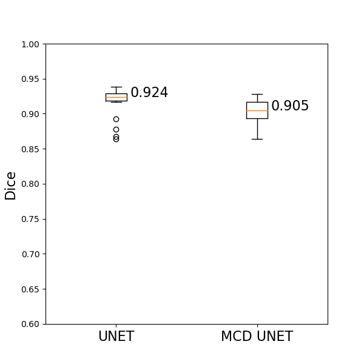
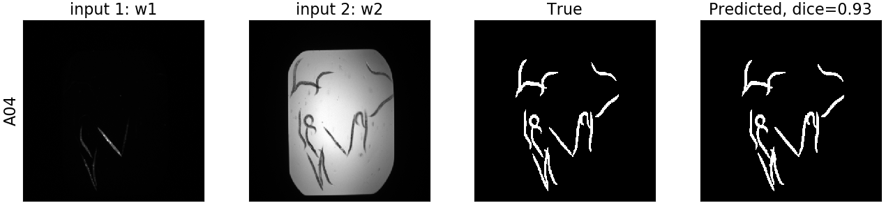
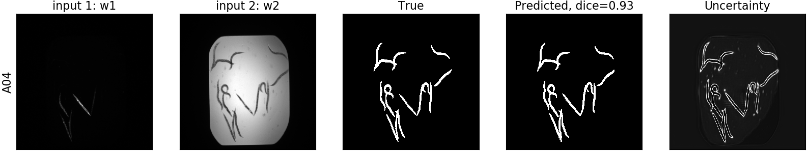

# Keras implementation of a UNET for image segmentation

This repository provides a keras implementation of a [UNET](https://arxiv.org/abs/1505.04597) and tests it by performing segmentation on publicly available data.

## Corresponding blog post:

The results presented in this repository are explained in detail in this [blog post]().

## Data: we will use the C. Elegans data available from the [Broad Bioimage Benchmark Collection](https://data.broadinstitute.org/bbbc/BBBC010/)

- [Input images](https://data.broadinstitute.org/bbbc/BBBC010/BBBC010_v2_images.zip): download and extract into ./data, then delete the '\_MACOSX' subfolder within BBBC010_v2_images. Each input image corresponds to two input channels (Brightfield/GFP). Each channel corresponds to a separate grayscale image.
- [Target masks](https://data.broadinstitute.org/bbbc/BBBC010/BBBC010_v1_foreground.zip): download and extract into ./data

The goal is to predict the segmentation mask of each image, based on the two input channels. An example image is shown below:

## List of files:
- load_data.py: loads the data, splits into training, validation and test sets, and saves them to disk as numpy arrays. The images are resized to 400x400 pixels and normalized to [0,1].
- unet_train.py: trains a UNET implemented with keras on the training data. Saves the best model according to the performance on the validation set.
- unet_evaluate.py: evaluates the performance of the trained model on the left out test set.
- mcd_unet_train.py: trains a Monte Carlo Dropout (MCD) UNET implemented with keras on the training data. Saves the best model according to the performance on the validation set. The advantage of the MCD UNET is its ability to generate segmentation maps, as well as uncertainty estimates.
- mcd_unet_evaluate.py: evaluates the performance of the trained MCD UNET model on the left out test set.

## Results:

The trained UNET network achieves a median [dice score](https://en.wikipedia.org/wiki/S%C3%B8rensen%E2%80%93Dice_coefficient) of 92.4% on the left out test set, while the MCD UNET achieves a similar dice score of 90.5% while also estimating the uncertainty of the predicted segmentation maps. All test set predictions for UNET can be found [here](./figures/test_set_all_unet_div8_495K.png), while all test set predictions for MCD UNET can be found [here](./figures/test_set_all_mcd_unet_div8_495K.png). The results of the MCD unet correspond to averaged results of T=20 models with dropout probability of 50% during inference time (during model.predict()), similar to what is presented in [DeVries et al., 2018](https://arxiv.org/abs/1807.00502).

The dice scores achieved by both models on the test set are summarized visually as follows:

Some exemplary results for both models are the following:

#### UNET

Here we can see the input channels, as well as the true and predicted segmentation masks.

<!---->

 
 
 
 
 
 
 
 
 
 
Next, for the MCD UNET we can see the segmentation, as well as its corresponding uncertainty:

#### MCD UNET

